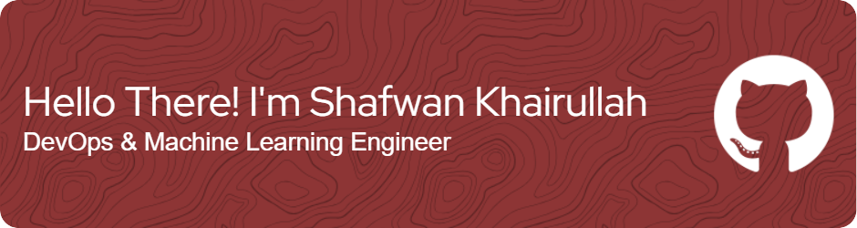

# Hello Everyone!

<!--
**shakaruu/shakaruu** is a ✨ _special_ ✨ repository because its `README.md` (this file) appears on your GitHub profile.

Here are some ideas to get you started:

- 🔭 I’m currently working on ...
- 🌱 I’m currently learning ...
- 👯 I’m looking to collaborate on ...
- 🤔 I’m looking for help with ...
- 💬 Ask me about ...
- 📫 How to reach me: ...
- 😄 Pronouns: ...
- ⚡ Fun fact: ...
-->

Introducing me Shafwan Khairullah, you can call me Awan. I have a keen interest in DevOps and Machine Learning. Therefore, I am currently studying these fields hard. I am still a newbie on GitHub, I hope I can contribute to the things I am interested in here very well and consistently.
**Nice to meet you guys >~>!**

### Programming Languages Currently Studied :

### My Social Media

 